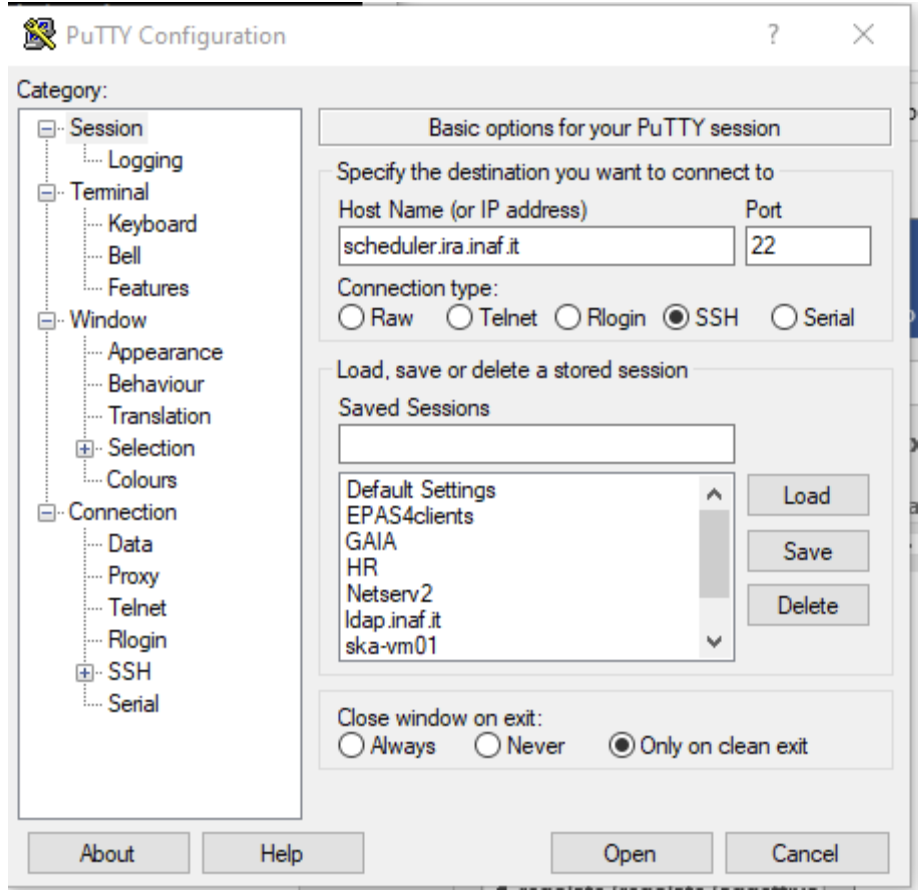

First steps
===========

Account and resources request
-----------------------------

The PLEIADI@INAF project provides HPC computing resources and technical support for research and teaching activities. 

The computing resources (see Section :doc:`Cluster structure <documentation/clusters/index>`) are managed by a board (board.pleiadi@inaf.it) which assigns calculation time and credentials for resources usage. 

To request calculation resources, you need to fill in an application form. The form and other information concerning the calculation resources can be found at the website `Resources <https://www.ict.inaf.it/computing/Pleiadi/>`_.

The user will receive an e-mail with credential details, i.e. a username and a password. The username will be of the form "Fistinitialof thenameSurname", all lowercase. The account is to be considered active from the moment you receive the confirmation e-mail containing your login credentials.

The account expires as indicated in the application form. To renew the account you must send again the same form sent in the first request, taking care to change the fields with the updated information.

Connecting to the cluster
------------------------

The access to the cluster depends on the Operating System present on your personal laptop. If you have a Linux, Unix or OSX Operating System you can use the ``ssh`` client from command line, from whichever terminal.

Specifically, to connect to the Pleiadi cluster frontend as a user with a certain username, execute:

``$ ssh <username>@pleiadi.oact.inaf.it``

For example, for the user ``pippo`` the login command is:

``$ ssh pippo@pleiadi.oact.inaf.it``

After executing the ``ssh`` command, the login can be completed inserting a password or without the need of inserting a password, if a public key created on your laptop is provided to the cluster.

#. **With the password**: insert the password provided by the cluster administrator when your user was created on the cluster. It is recommended to change the provided password at first login with the ``passwd`` command. Anyway, the password annually expires and the users can renew it with the ``passwd`` command. There are no restrictions on the password length and composition but it is recommended to choose a password made of 8 or more characters, containing numbers and both uppercase and lowercase letters.
#. **With key exchange**:

   #. Create on your laptop a public/private couple of keys, with the command ``$ ssh-keygen``, confirming the default values during the procedure. With this command, a public (``id_rsa.pub``) and a private (``id_rsa``) key are created in the ``.ssh`` directory of your laptop.
   #. Login to Pleiadi inserting the password provided by the administrator.
   #. Append the content of the ``id_rsa.pub`` key created on your laptop in the ``/home/pippo/.ssh/authorized_keys`` file.
   #. From the next login, you will be able to execute ``$ ssh pippo@pleiadi.oact.inaf.it`` without password insertion.
   
If you have a Windows Operating System on your laptop, it is recommended to use the PuTTY application (available at the website `PuTTY <http://www.putty.org>`_), to be configured as in the below figure:

    Figure 1: Putty - Configuration for the access to remote clusters from computers with Windows Operating System.

