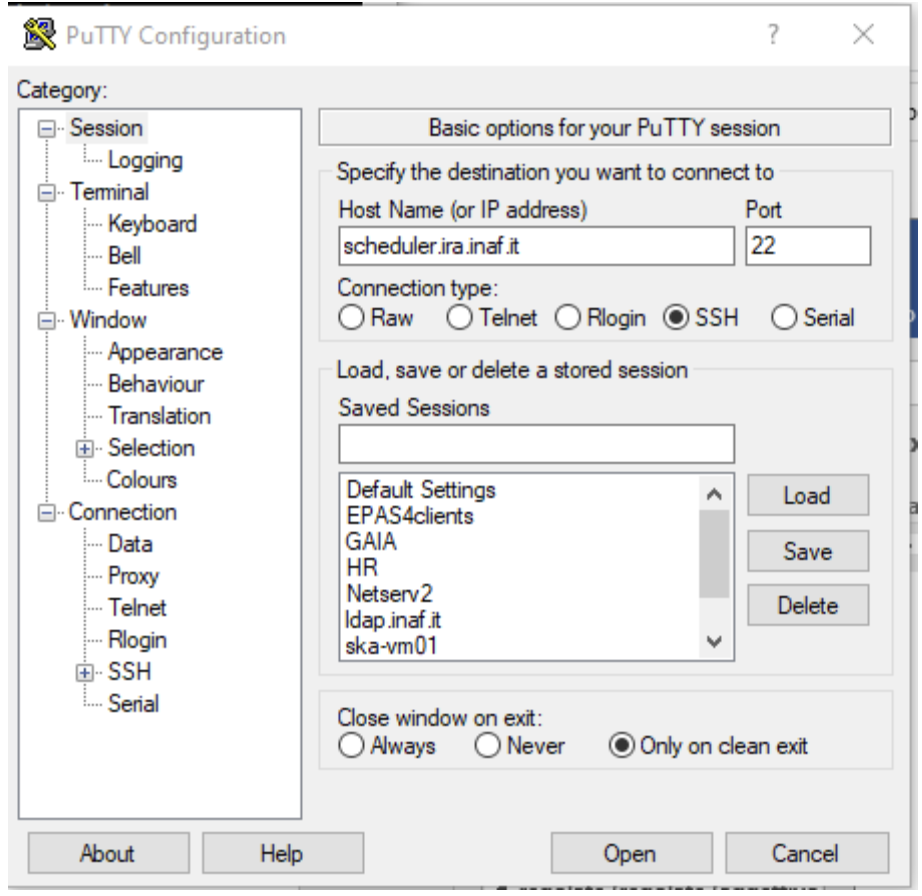

*******************
Userguide for Pleiadi cluster
*******************

.. contents:: Table of Contents

Note: along the entire document the dollar $ sign indicates the shell prompt.

The current guide illustrates the usage of the HPC@PLEIADI system (Pleiadi cluster) of the INAF-Osservatorio Astrofisico di Catania (OACT) institution based on the SLURM workload manager system.

Gentlemen’s agreement
====================

#. Using this cluster for research purposes, the user automatically autorizes the Pleiadi's Staff to publish her/his personal data (e.g name, surname, and research group) and the data associated to the research on the website `Pleiadi <http://www.pleiadi.inaf.it>`_, in all the other paper publications broadcast by HPC@PLEIADI (e.g. annual reports and presentations), and on any other support system.
#. Using a HPC@PLEIADI system for research purposes, the user accepts to cite the PLEIADI services on all her/his scientific publications in papers, conference proceedings, books, and any other support type. We suggest the following citation "INAF’s PLEIADI calculation resources were employed (`<http://www.pleiadi.inaf.it>`_)".

Rules for the Pleiadi cluster usage
====================

#. Calculations, simulations, etc. have NEVER to be launched directly from command line on the frontend node, in order not to risk to make unusable the frontend node or other shared resources (penalty of account blocking and task interruption). ALWAYS pass through the execution queues of the SLURM scheduler (also in case of compilation).
#. It is NOT allowed to employ the resources for usage different from the research and/or teaching purposes.
#. Every user is responsable for every activity either performed by or attributable to herself/himself. Therefore, the account sharing is discouraged and it is only allowed if communicated in time to the HPC Staff. In general, it is NOT allowed to share sensitive data (e.g. username and password) that the user undertakes to properly store.

Quick start – First steps 
====================

Account and resources request
-------------------

The PLEIADI@INAF project provides HPC computing resources and technical support for research and teaching activities. 

The computing resources (see Section `Cluster structure`_) are managed by a board (board.pleiadi@inaf.it) which assigns calculation time and credentials for resources usage. 

To request calculation resources, you need to fill in an application form. The form and other information concerning the calculation resources can be found at the website `Resources <https://www.ict.inaf.it/computing/Pleiadi/>`_.

The user will receive an e-mail with credential details, i.e. a username and a password. The username will be of the form "Fistinitialof thenameSurname", all lowercase. The account is to be considered active from the moment you receive the confirmation e-mail containing your login credentials.

The account expires as indicated in the application form. To renew the account you must send again the same form sent in the first request, taking care to change the fields with the updated information.

Monitoring of the used CPU hours (CPU hours saldo)
^^^^^^^^^^^^^^^^^^^^^^

To monitor the utilization of the CPU hours assigned when the account was activated by the board members, according to the user's request, you can use the SLURM report command ``sreport``, for example with the follwing options: 

``$ sreport -t Hour cluster AccountUtilizationByUser user=<username> start=M1/DD1/YY1 end=M2/DD2/YY2``

For example, the command::

  $ sreport -t Hour cluster AccountUtilizationByUser user=pippo start=6/10/22 end=6/13/22
    
    --------------------------------------------------------------------------------
    Cluster/Account/User Utilization 2022-06-10T00:00:00 - 2022-06-12T23:59:59 (259200 secs)
    Usage reported in CPU Hours
    --------------------------------------------------------------------------------
     Cluster         Account     Login     Proper Name     Used   Energy 
    --------- --------------- --------- --------------- -------- -------- 
    pleiadi-+           pippo    pippo+                      300        0
    
provides the CPU Hours used by the user ``pippo`` from 00:00:00 of 10/06/2022 to 23:59:59 of 12/06/2022.

Connecting to the cluster
-------------------

The access to the cluster depends on the Operating System present on your personal laptop. If you have a Linux, Unix or OSX Operating System you can use the ``ssh`` client from command line, from whichever terminal.

Specifically, to connect to the Pleiadi cluster frontend as a user with a certain username, execute:

``$ ssh <username>@pleiadi.oact.inaf.it``

For example, for the user ``pippo`` the login command is:

``$ ssh pippo@pleiadi.oact.inaf.it``

After executing the ``ssh`` command, the login can be completed inserting a password or without the need of inserting a password, if a public key created on your laptop is provided to the cluster.

#. **With the password**: insert the password provided by the cluster administrator when your user was created on the cluster. It is recommended to change the provided password at first login with the ``passwd`` command. Anyway, the password annually expires and the users can renew it with the ``passwd`` command. There are no restrictions on the password length and composition but it is recommended to choose a password made of 8 or more characters, containing numbers and both uppercase and lowercase letters.
#. **With key exchange**:

   #. Create on your laptop a public/private couple of keys, with the command ``$ ssh-keygen``, confirming the default values during the procedure. With this command, a public (``id_rsa.pub``) and a private (``id_rsa``) key are created in the ``.ssh`` directory of your laptop.
   #. Login to Pleiadi inserting the password provided by the administrator.
   #. Append the content of the ``id_rsa.pub`` key created on your laptop in the ``/home/pippo/.ssh/authorized_keys`` file.
   #. From the next login, you will be able to execute ``$ ssh pippo@pleiadi.oact.inaf.it`` without password insertion.
   
If you have a Windows Operating System on your laptop, it is recommended to use the PuTTY application (available at the website `PuTTY <http://www.putty.org>`_), to be configured as in the below figure:

    Figure 1: Putty - Configuration for the access to remote clusters from computers with Windows Operating System.

   
Copying files (basics)
-------------------

**Note**: All the commands listed below have to be executed on your pc.

#. **With the** ``scp`` **command**: the ``scp`` command works as the ``cp`` command except for the fact that it works across the network to copy files from one computer to another. You have to execute the following commands:

   #. To copy a file from your laptop to Pleiadi: ``$ scp /path-on-your-laptop/my_file.txt pippo@pleiadi.oact.inaf.it:/path-on-Pleiadi/``
   #. To copy a file from Pleiadi to your laptop: ``$ scp pippo@pleiadi.oact.inaf.it:/path-on-Pleiadi/my_file.txt /path-on-your-laptop/``
   #. To copy a directory from your laptop to Pleiadi: ``$ scp -r /path-on-your-laptop/my_dir pippo@pleiadi.oact.inaf.it:/path-on-Pleiadi/``
   #. To copy a directory from Pleiadi to your laptop: ``$ scp -r pippo@pleiadi.oact.inaf.it:/path-on-Pleiadi/my_dir /path-on-your-laptop/``
   
#. **With the** ``rsync`` **command**: As syntax, ``rsync`` works as the ``scp`` command. The main difference is that, differently from ``scp``, when copying the content of one directory in another directory, it copies only the files that are different from the two directories, which saves time. Moreover, with respect to the ``scp`` protocol, ``rsync`` guarantees (1) more security (it allows encryption of data using ``ssh`` protocol during transfer), (2) less bandwidth (it employs compression and decompression of data blocks during the transfers), and (3) the absence of special privileges to install and execute it. The correspondent commands listed above with ``rsync`` are:

   #. ``$ rsync /path-on-your-laptop/my_file.txt pippo@pleiadi.oact.inaf.it:/path-on-Pleiadi/``
   #. ``$ rsync pippo@pleiadi.oact.inaf.it:/path-on-Pleiadi/my_file.txt /path-on-your-laptop/``
   #. ``$ rsync -r /path-on-your-laptop/my_dir pippo@pleiadi.oact.inaf.it:/path-on-Pleiadi/``
   #. ``$ rsync  -r pippo@pleiadi.oact.inaf.it:/path-on-Pleiadi/my_dir /path-on-your-laptop/``

Editing files
-------------------

To edit a file, the most convenient way is to use a terminal-based editor. Some example are Vi, Vim, Emacs, Nano, mcedit, ne, slap, micro, pico, Joe or mped. **Vi, Vim, Emacs, and Nano are already installed on Pleiadi**.

SLURM quick start tutorial
-------------------

As workload manager to schedule jobs, Pleiadi employs SLURM. SLURM schedules jobs on a certain amount of allocated resources (number of nodes, number of CPUs per node, time limit, memory amount, etc.) according to the specifications of the user.

Gathering information
^^^^^^^^^^^^^^^^^^^^^^

To obtain information about SLURM on your cluster the ``sinfo`` and the ``squeue`` commands are quite useful.

The ``sinfo`` command provides information about:

#. **PARTITION**: The partitions available on the cluster, where a partition is a set of compute nodes logically grouped and dedicated to different tasks (e.g. batch processing, debugging, post processing, or visualization). The default partition is marked with an asterisk. The partitions present on Pleiadi are ``debug``, ``gpu``, ``v100``, and ``256g``, where ``256g`` is the default partition;
#. **AVAIL**: The state of the partitions;
#. **TIMELIMIT**: The maximum time limit for a job launched by any user in days-hours:minutes:seconds. If the parameter is “infinite” it means no time limit is set for that partition;
#. **NODES**: The number of nodes with a particular configuration in each partition;
#. **STATE**: The state of each group of nodes;
#. **NODELIST**: The list of nodes in each group.

Example of output of the ``sinfo`` command on Pleiadi::

    $ sinfo
      PARTITION  AVAIL  TIMELIMIT  NODES   STATE  NODELIST
          debug     up   infinite      1   inval  r35c1s10
          debug     up   infinite      5   down*  r35c1s11,r35c3s[11-12],r35c5s10,r35c6s11
          debug     up   infinite      2     mix  r35c1s09,r35c6s12
          debug     up   infinite      8   alloc  r35c1s[01-08]
          debug     up   infinite     56    idle  r35c1s12,r35c2s[01-12],r35c3s[01-10],r35c4s[01-12],r35c5s[01-09,11-12],r35c6s[01-10]
          gpu       up   infinite      6    idle  r33c2s[01-06]
          v100      up   infinite      2    idle  r33c2s[01-02]
          256g*     up   infinite      1   inval  r35c1s10
          256g*     up   infinite      1   down*  r35c1s11
          256g*     up   infinite      1     mix  r35c1s09
          256g*     up   infinite      8   alloc  r35c1s[01-08]
          256g*     up   infinite      1    idle  r35c1s12
          
           
If ``sinfo`` is launched with the ``-N`` option, it shows the output in a node-oriented fashion.

Example of output of the ``sinfo -N`` command on Pleiadi::

     $ sinfo -N
       r33c2s01    1     gpu* idle 
       r33c2s02    1     gpu* idle 
       r33c2s03    1     gpu* idle 
       r33c2s04    1     gpu* idle 
       r33c2s05    1     gpu* idle 
       r33c2s06    1     gpu* idle 
       r35c1s01    1     debug alloc
       r35c1s02    1     debug alloc
       r35c1s03    1     debug idle 
       r35c1s04    1     debug idle 
       r35c1s05    1     debug idle 
       r35c1s06    1     debug idle 
       r35c1s07    1     debug idle 
       r35c1s08    1     debug idle 
       r35c1s09    1     debug idle 
       r35c1s10    1     debug idle 
       r35c1s11    1     debug down*
       ...

When also the ``-l`` option is added, more information about the nodes is shown, such as the number of CPUs, the memory, the temporary disk space (also called scratch space), the node weight (an internal parameter specifying preferences in nodes for allocations when there are multiple possibilities), the features of the nodes (such as processor type for instance), and the reason, if applicable, for which a node is down.
 
Example of output of the ``sinfo -Nl`` command on Pleiadi::
 
     $ sinfo -Nl
       Wed Apr 13 16:13:16 2022
       NODELIST   NODES PARTITION       STATE CPUS    S:C:T MEMORY TMP_DISK WEIGHT AVAIL_FE REASON              
       r33c2s01       1     v100*        idle 36     2:18:1 128236        0      1   (null) none                
       r33c2s01       1       gpu        idle 36     2:18:1 128236        0      1   (null) none                
       r33c2s02       1       gpu        idle 36     2:18:1 128236        0      1   (null) none                
       r33c2s02       1     v100*        idle 36     2:18:1 128236        0      1   (null) none                
       r33c2s03       1       gpu        idle 36     2:18:1 128236        0      1   (null) none                
       r33c2s04       1       gpu        idle 36     2:18:1 128236        0      1   (null) none                
       r33c2s05       1       gpu        idle 36     2:18:1 128236        0      1   (null) none                
       r33c2s06       1       gpu        idle 36     2:18:1 128236        0      1   (null) none                
       r35c1s01       1     debug   allocated 36     2:18:1 128236        0      1   (null) none                
       r35c1s02       1     debug   allocated 36     2:18:1 128236        0      1   (null) none                
       r35c1s03       1     debug        idle 36     2:18:1 128236        0      1   (null) none                
       r35c1s04       1     debug        idle 36     2:18:1 128236        0      1   (null) none                
       r35c1s05       1     debug        idle 36     2:18:1 128236        0      1   (null) none                
       r35c1s06       1     debug        idle 36     2:18:1 128236        0      1   (null) none                
       r35c1s07       1     debug        idle 36     2:18:1 128236        0      1   (null) none                
       r35c1s08       1     debug        idle 36     2:18:1 128236        0      1   (null) none                
       r35c1s09       1     debug        idle 36     2:18:1 128236        0      1   (null) none                
       r35c1s10       1     debug        idle 36     2:18:1 128236        0      1   (null) none                
       r35c1s11       1     debug       down* 36     2:18:1 128236        0      1   (null) Not responding
       ...
       
The ``squeue`` command provides information about the jobs that are currently running (**ST** ``R``) or pending, namely waiting for resources (**ST** ``PD``). Specifically it provides information about:

#. **JOBID**: The ID of the job;
#. **PARTITION**: The partition to which the job is assigned;
#. **NAME**: The name of the job;
#. **USER**: The user that launched the job;
#. **ST**: The status of the job (it can be e.g. ``R`` or ``PD``)
#. **TIME**: It shows how long the job has been running;
#. **NODES**: The number of nodes on which the job is running;
#. **NODELIST(REASON)**: The nodes on which the job is running, for running jobs, or the reason why the job is pending, for pending jobs. Two possible reasons are ``(Resources)``, which means that the job has not started because the requested resources are not available in sufficient amount and ``(Priority)``, which means that this job will not run until another pending job with higher priority will run.

Example of output of the ``squeue`` command on Pleiadi::

    $ squeue
      JOBID PARTITION     NAME        USER  ST       TIME  NODES NODELIST(REASON)
         83     debug my_job_1       pippo   R    6:20:48      2 r35c1s[01-02]
         84       gpu my_job_2       pluto  PD    0.00         6 (Resources)
         85     debug my_job_3    topolino  PD    0.00        16 (Priority)

To interrupt the execution of a job we use the ``scancel`` command in this way:

``$ scancel <JOBID>``

(e.g. ``scancel 83``).

Creating and submitting a job
^^^^^^^^^^^^^^^^^^^^^^
The typical way of creating a job is to write a submission script. A submission script is a shell script, e.g. a Bash script, whose comments ``#``, if they are prefixed with ``SBATCH``, are understood by Slurm as parameters describing resource requests and other submissions options. You can get the complete list of parameters from the sbatch manpage ``man sbatch``.

The first line of a submission script must be the shebang, e.g.:

``#!/bin/bash``

which must be followed by the ``#SBATCH`` directives.

A possible heading of a submission script, which might be called ``run_ppl.cmd``, can be::

 #!/bin/bash
 #SBATCH --job-name=my_job_1
 #SBATCH --time=00:10:00
 #SBATCH --ntasks=1
 #SBATCH --mem-per-cpu=100
 #SBATCH --error=job.%j.err
 #SBATCH --output=job.%j.out

In this submission script a job called ``my_job_1`` requests 1 CPU (task) for 10 minutes of time, with 100 MB of RAM memory per CPU, in the default partition (since the partition is not specified). It is possible to specify a particular partition with the  ``--partition`` option. Possible error messages due to the job and the output produced by the job will be saved in the ``job.<JOBID>.err`` and ``job.<JOBID>.out`` files. Instead of requiring the amount of RAM memory per CPU with the ``--mem-per-cpu`` option, it is possible to request the amount of RAM memory per node with the ``--mem`` option.

After the heading, the submission script ``run_ppl.cmd`` might continue as::

 cd /path/to/my_working_directory
 
 srun ./my_executable
 srun hostname
 srun sleep 60
 
 exit 0
 
that is, a working directory, ``/path/to/my_working_directory``, is set and the job will run the first job step ``srun ./my_executable``, namely it will execute the program executable ``my_executable`` in the working directory (``./``) on the node where the resource requested by the heading part of the job script is allocated. Then, a second job step, ``srun sleep 60``, will execute the ``sleep 60`` command on the requested resource. The command ``srun`` in front of the ``./my_executable``, the ``hostname``, and the ``sleep 60`` commands is optional.

After writing the submission script, it has to be submitted to Slurm through the ``sbatch`` command::

 $ sbatch run_ppl.cmd
   sbatch: Submitted batch job 83
   
The job then enters the queue in the PENDING state. Once resources become available and the job has highest priority, an allocation is created for it and it goes to the RUNNING state. If the job completes correctly, it goes to the COMPLETED state, otherwise, it is set to the FAILED state.

To obtain near-realtime information about the running job (e.g. memory consumption) you can execute the ``sstat`` command:

``$ sstat -j <JOBID>``

Specifically, you can select which information you want the command ``sstat`` to show with the ``--format`` option (see the manpage ``man sstat`` for more information on this command).

Going parallel
^^^^^^^^^^^^^^^^^^^^^^

The example in the previous section illustrates a *serial* job which runs a single CPU on a single node, and that does not exploit the resources available in the multiple nodes in the cluster.

We illustrate below some examples of *parallel* jobs.

Parallel job with MPI or other multi-process paradigms
""""""""""""""""""

A job parallelized with MPI is a multi-process program. Since in the Slurm context, a task is identified with a process, a multi-process program is made of several tasks. The tasks are requested with the ``-–ntasks`` option, that we have already seen in the `Creating and submitting a job`_ section. The tasks can be in a single node or spread across more nodes. The number of nodes is specified with the ``--nodes`` option and the number of tasks per node is specified with the ``--ntasks-per-node`` option. If the cores in each node of the cluster are distributed in more sockets, also the ``--ntasks-per-socket`` option, that specifies the number of tasks per socket in a node, can be set. The Pleiadi cluster is a dual socket platform, namely it has two sockets per node, and for optimizing job performances, it is recommended to set this option to the half of the value set for the ``--ntasks-per-node`` option. In this way, the tasks in each node are equally distributed between the two sockets. If the options ``--nodes`` and ``--ntasks-per-node`` are set, the option ``-–ntasks`` is automatically determined as ``-–ntasks = --nodes x --ntasks-per-node`` and it can be omitted in the Slurm submission script.

We show below an example of submission script for a job parallelized with MPI::

 #!/bin/bash
 #SBATCH --job-name=my_job_2   
 #SBATCH --time=10:00:00
 #SBATCH --nodes=2
 #SBATCH --ntasks-per-node=36
 #SBATCH --ntasks-per-socket=18
 #SBATCH --mem=125000
 #SBATCH --error=job.%j.err
 #SBATCH --output=job.%j.out
 #SBATCH --account=my_account
 #SBATCH --partition=debug

 cd /path/to/my_working_directory
 module load gcc-11.2.0 openmpi-4.1.2/gcc-11.2.0
 
 mpirun -np 72 ./my_MPI_executable
 
 exit 0

In this submission script, a job called ``my_job_2`` requests 2 nodes with 36 CPUs per node, and in each node the 36 CPUs are equally distributed between the two sockets (18 CPUs per socket). It also requests 125 GB of RAM per node, and it will run on the debug partition. The error and output messages of the job will be saved in the ``job.<JOBID>.err`` and ``job.<JOBID>.out`` files. Since Pleiadi has 36 cores per node and it is a dual-socket platform, the ``--ntasks-per-node`` and ``--ntasks-per-socket`` options are set to the maximum allowed values. This job will run on a total number of tasks equal to ``-–ntasks = --nodes x --ntasks-per-node = 72``. A new option, ``--account``, is added to the submission script, which means that the computational hours for the job execution will be taken from the ``my_account`` account.
Once the job is submitted, the command ``mpirun -np 72`` will create 72 instances of the executable ``my_MPI_executable`` on the requested resources allocated by Slurm. As in the example in the `Creating and submitting a job`_ section, the working directory is set to ``/path/to/my_working_directory``. The ``module load gcc-11.2.0 openmpi-4.1.2/gcc-11.2.0`` command is used to load in sequence the ``gcc-11.2.0`` and ``openmpi-4.1.2/gcc-11.2.0`` modules. The modules istruct the shell to modify a user’s environment: in this way a user can customize its own environment according to her/his specific needs. In this example, we load the ``gcc-11.2.0`` and the ``openmpi-4.1.2/gcc-11.2.0`` modules, to use (Open MPI) 4.1.2 to compile and run the application ``my_MPI.cpp``, which can be compiled prior to the submission of the Slurm script, with:

``$ mpicc my_MPI.c -o my_MPI_executable``

Loading this module we have the following compiler and MPI versions::

 $ mpicc --version
 gcc (GCC) 11.2.0
 Copyright (C) 2021 Free Software Foundation, Inc.
 This is free software; see the source for copying conditions.  There is NO
 warranty; not even for MERCHANTABILITY or FITNESS FOR A PARTICULAR PURPOSE.

 $ mpirun --version
 mpirun (Open MPI) 4.1.2

 Report bugs to http://www.open-mpi.org/community/help/
 
Other possible modules to use to compile and execute a MPI program are those of the ``/opt/Modules/compilers/intel`` group. For more information about modules consult the website `Modules <https://modules.readthedocs.io/en/latest/>`_, and to see all the modules available on Pleiadi cluster see the section `Available modules`_.

Parallel job with a shared memory paradigm (e.g. OpenMP)
""""""""""""""""""

A job parallelized with a shared memory paradigm (e.g. OpenMP) is a multithreaded program. A multithreaded program is made of only one task that employs more CPUs. These CPUs are requested/created with the ``--cpus-per-task`` option. Whereas with the ``--ntasks`` option, the tasks can be scheduled among several nodes, as specified in the Slurm submission script, with the ``--cpus-per-task`` option, the CPUs are assigned to a single task in one node.

We show below an example of submission script for a job parallelized with OpenMP::

 #!/bin/bash
 #SBATCH --job-name=my_job_3   
 #SBATCH --time=10:00:00
 #SBATCH --ntasks=1
 #SBATCH --cpus-per-task=4
 #SBATCH --mem=125000
 #SBATCH --error=job.%j.err
 #SBATCH --output=job.%j.out
 #SBATCH --account=my_account
 #SBATCH --partition=debug
 
 cd /path/to/my_working_directory
 module load gcc-11.2.0
 
 export OMP_NUM_THREADS=$SLURM_CPUS_PER_TASK
 ./my_OpenMP_executable
 
 exit 0
 
In this submission script, a job called ``my_job_3`` will run on 4 CPUs on the same task, reserved in a single compute node. The number of OpenMP threads on which the job will run can be set with the ``OMP_NUM_THREADS`` environment variable, that in this case is set to the value given to the ``--cpus-per-task`` option. The value assigned to the ``--cpus-per-task`` option is extracted with the ``$SLURM_CPUS_PER_TASK`` command. 
In this example, we load the module ``gcc-11.2.0``, where the version of the compiler is::

 $ gcc --version
 gcc (GCC) 11.2.0
 Copyright (C) 2021 Free Software Foundation, Inc.
 This is free software; see the source for copying conditions.  There is NO
 warranty; not even for MERCHANTABILITY or FITNESS FOR A PARTICULAR PURPOSE.

and the program that uses OpenMP launched by this job can be compiled with
 
``$ gcc -fopenmp my_OpenMP.c -o my_OpenMP_executable``
The ``-fopenmp`` option might be omitted.

Hybrid MPI+OpenMP parallel job
""""""""""""""""""

Some programs exploit both multi-process and shared memory paradigms. These kind of programs can be executed, for example, with a submission script like this::

 #!/bin/bash
 #SBATCH --job-name=my_job_4   
 #SBATCH --time=10:00:00
 #SBATCH --nodes=2
 #SBATCH --ntasks-per-node=18
 #SBATCH --ntasks-per-socket=9
 #SBATCH --cpus-per-task=2
 #SBATCH --mem=125000
 #SBATCH --error=job.%j.err
 #SBATCH --output=job.%j.out
 #SBATCH --account=my_account
 #SBATCH --partition=debug
 
 cd /path/to/my_working_directory
 module load gcc-11.2.0 openmpi-4.1.2/gcc-11.2.0
 
 export OMP_NUM_THREADS=$SLURM_CPUS_PER_TASK
 mpirun -np 36 ./my_MPI_OpenMP_executable
 
 exit 0

In this case, Slurm will allocate ``--ntasks = --nodes x --ntasks-per-node = 2 x 18 = 36`` tasks on 2 nodes, and 2 CPUs for each task. In this way, the computation assigned to each MPI process will be further parallelized on 2 OpenMP threads.

GPU parallel job
""""""""""""""""""

On Pleiadi cluster, 6 out of 72 nodes have one GPU. If you want to run a job parallelized on a GPU environment (e.g. with OpenACC or CUDA) you have to specify the GRES (Generic Resource Scheduling) option in the submission script:

``#SBATCH --gres=gpu:1``

It is important to note that the nodes having a GPU belong only to particular partitions. On the cluster Pleiadi the ``sinfo`` command, already seen in the `Gathering information`_ section, provides as output::

 $ sinfo
   PARTITION  AVAIL  TIMELIMIT  NODES   STATE  NODELIST
       ...
       gpu       up   infinite      6    idle  r33c2s[01-06]
       v100      up   infinite      2    idle  r33c2s[01-02]
       ...
        
which indicates that the 6 nodes that have a GPU belong to the ``gpu`` partition and that, in particular, the two nodes that have a GPU of the V100 type further belong to the v100 partition. Therefore, in the submission script the

``#SBATCH --partition=gpu``

or the 

``#SBATCH --partition=v100``

option has to be set.

An example of submission script for a job running on one GPU node is::

 #!/bin/bash
 #SBATCH --job-name=my_job_4   
 #SBATCH --time=10:00:00
 #SBATCH --ntasks=1
 #SBATCH --gres=gpu:1
 #SBATCH --mem=125000
 #SBATCH --error=job.%j.err
 #SBATCH --output=job.%j.out
 #SBATCH --account=my_account
 #SBATCH --partition=gpu
 
 cd /path/to/my_working_directory
 module load nvhpc_2022_221/gcc-11.2.0
 
 srun ./my_MPI_GPU_executable
 
 exit 0

In this example the task allocated on the requested node will also run on the GPU of the node. For this job, we loaded the ``nvhpc_2022_221/gcc-11.2.0`` module, that contains NVIDIA compilers, suitable for the compilation of GPU-based applications, and the ``gcc`` compiler of the ``11.2.0`` version. The ``nvhpc_2022_221/gcc-9.4.0`` and ``nvhpc_2022_221/gcc-10.3.0`` are also available, which contain the ``gcc`` compiler with the ``9.4.0`` and ``10.3.0`` versions, respectively.

Interactive jobs
^^^^^^^^^^^^^^^^^^^^^^

Slurm jobs are normally batch jobs in the sense that they are run unattended. If you want to have a direct view on your job, for tests or debugging, you have two options.
If you need simply to have an interactive Bash session on a compute node, with the same environment set as the batch jobs, run the following command:

``$ srun --pty bash``

Doing that, you are submitting a 1-CPU, default memory, default duration job that will return a Bash prompt when it starts.

If you need more flexibility, you will need to use the `salloc <https://slurm.schedmd.com/salloc.html>`_ command. The ``salloc`` command accepts the same parameters as ``sbatch`` as far as resource requirement is concerned. Once the allocation is granted, you can use ``srun`` in the same way you would do in a submission script.

Available modules
^^^^^^^^^^^^^^^^^^^^^^

On the cluster Pleiadi, there are several available modules to set a customized environment according to the user’s needs. The available modules can be visualized with the command ``module available`` or with its shortened formula ``module av``::

 $ module av
   ------------------------------ /opt/Modules/compilers/gcc -------------------------------
   gcc-9.4.0  gcc-10.3.0  gcc-11.2.0  

   ----------------------------- /opt/Modules/compilers/intel ------------------------------
   intel_xe_2020_update4  

   ----------------------------- /opt/Modules/compilers/nvidia -----------------------------
   nvhpc_2022_221/gcc-9.4.0  nvhpc_2022_221/gcc-10.3.0  nvhpc_2022_221/gcc-11.2.0  

   ---------------------------- /opt/Modules/compilers/openmpi -----------------------------
   openmpi-4.0.5-hfi        openmpi-4.1.2/gcc-10.3.0  
   openmpi-4.1.2/gcc-9.4.0  openmpi-4.1.2/gcc-11.2.0  

   ---------------------------- /opt/Modules/compilers/mvapich -----------------------------
   mvapich2-2.3b-hfi  

   ---------------------------- /opt/Modules/libraries/cfitsio -----------------------------
   cfitsio-3.49  cfitsio-4.1.0  

   ------------------------------ /opt/Modules/libraries/gsl -------------------------------
   gsl-2.7.1  

   ----------------------------- /opt/Modules/libraries/eigen ------------------------------
   eigen-3.4.0  

   ---------------------------- /opt/Modules/libraries/OpenBLAS ----------------------------
   OpenBLAS-0.3.20  

   ----------------------------- /opt/Modules/libraries/CCfits -----------------------------
   CCfits-2.6  

   ----------------------------- /opt/Modules/libraries/lapack -----------------------------
   lapack-3.10.1  

   ------------------------------ /opt/Modules/libraries/fftw ------------------------------
   fftw-3.3.10  

   --------------------------- /opt/Modules/libraries/armadillo ----------------------------
   armadillo-11.0.1  

   ------------------------------ /opt/Modules/libraries/hdf5 ------------------------------
   hdf5-1.12.1  hdf5-1.12.1_gcc-11.2.0

   -------------------------------- /opt/Modules/tools/casa --------------------------------
   casa-pipeline-5.6.3-19  casa-release-5.8.0-109  
   casa-pipeline-6.2.1-7   casa-release-6.4.4-31   

   ---------------------------- /opt/Modules/tools/singularity -----------------------------
   singularity-3.9.9  

   Key:
   modulepath 
   
   

Compute nodes main features
^^^^^^^^^^^^^^^^^^^^^^

The below table summarizes the main features of the compute nodes of the Pleiadi cluster, which are useful to set the Slurm options in the submission scripts or for interactive jobs submissions: 

+-----------------------------+----------------+
| Number of CPUs              | 36             |
+-----------------------------+----------------+
| Number of sockets           | 2              |
+-----------------------------+----------------+
| Number of cores per socket  | 18             |
+-----------------------------+----------------+
| Number of threads per core  | 1              |
+-----------------------------+----------------+
| RAM memory                  | 128 or 256 GB  |
+-----------------------------+----------------+

Managing files
====================

**Note:** There is no backup of the data stored on the Pleiadi cluster. Any removed file is lost forever. It is the user’s responsibility to keep a copy of the contents of their data in a safe place.

The cluster areas
-------------------

The *home* directory
^^^^^^^^^^^^^^^^^^^^^^

Once logged in on the frontend node, the user will end up in its *home* directory, that has the following absolute path:

``/home/username``

To come back to the *home* directory from another directory, the user can execute the command:

``$ cd $HOME``

or simply

``$ cd``

The *home* directory absolute path can be shown with the command::

 $ echo $HOME
 /home/username

The *home* directory is available on the frontend node and on all the compute nodes of the cluster, since it is shared with the Network Filesystem protocol (``nfs``).

The *home* directory is dedicated to the data necessary to the launching of the task, to the data that have to be saved at the end of each task, to source codes (programs, scripts), to configuration files, and to small datasets (like input files). For each user all the files in this directory cannot exceed the quota of 20 GB (see also Section `Quota`_). 

**Note:** To your main working activity, e.g. with large datasets, do not use the *home* directory but the *work* directory (see Section `The work directory`_). 

The *home* directory is accessible only to the user owner of the *home* directory.

To copy files from your own host on your personal computer to your own *home* directory on the Pleiadi cluster it is possible to use the ``scp`` command (see Section `Copying files (basics)`_) in this way:

``$ scp -r /path/to/local/dir/ username@pleiadi.oact.inaf.it:/home/username``

Viceversa, to copy files from your own *home* directory on the Pleiadi cluster to your own host on your personal computer it is possible to use the ``scp`` command in this way:

``$ scp -r username@pleiadi.oact.inaf.it:/home/username /path/to/local/dir/``

The *work* directory
^^^^^^^^^^^^^^^^^^^^^^

For more memory-demanding computations, the user should not refer to the *home* directory but to the *work* directory. The *work* directory can be accessed with the following command:

``$ cd $WORK``

and it has the following absolute path::
 
 $ echo $WORK
 /mnt/beegfs/username

where ``/mnt/beegfs`` is the storage volume, defined with the high-performance, scalability, flexibility, and robustness BeeGFS parallel filesystem (`BeeGFS <https://www.beegfs.io/c/>`_). Each user will have a personal directory called ``<username>`` on the storage area ``/mnt/beegfs``, which cannot be accessed by other users. For each user all the files in this directory cannot exceed the quota defined in the user's request of the account (see also Section `Quota`_). As the *home* directory, the *work* directory is available both on the frontend and on all the compute nodes of Pleiadi cluster, since it is shared with ``nfs``.

Data archiving
^^^^^^^^^^^^^^^^^^^^^^

If the account is not reactivated within 3 MONTHS after the expiration indicated in the application form, two compressed archives containing all the files present in the *home* and in the *work* areas are created in the respective directories. After further 6 months from the creation of the compressed archives, i.e. after 9 months after the expiration of the account, all the archives are definitely removed from the storage and the account is deleted.

Quota
^^^^^^^^^^^^^^^^^^^^^^

The following storage quota are set for the different areas of the Pleiadi cluster:

#. *home*: each user can use up to 20 GB of disk space.
#. *work*: each user can use up to the quota defined in the request of the account.

The users can request an increase of the quota reserved for them sending us an e-mail at the address board.pleiadi@inaf.it, including the proper motivations for the request that will be successively evaluated by the local Staff. Possible quota extensions have to have an expiration, that must be as short as possible. Anyway, the period required for the quota extension cannot exceed the expiration date expected for the account.

For the accounts that will result in overquota to the monthly control following the expiration of the same, the data will be archived in advance as soon as the normal grace period granted (7 days) has passed. If at the next monthly check the account will still be overquota even after the anticipated creation of compressed archives, we will proceed to the early removal of archive files. 

To monitor the used quota you can use the ``du -h`` command, to be used in the following way:

``$ du -h /home/username``

to monitor the *home* quota or

``$ du -h /mnt/beegfs/username``

to monitor the *work* quota. A periodic control of the quota limits is performed by the staff members.

Transferring files to and from the clusters
-------------------

**Note**: All the commands listed below have to be executed on your pc.

The two main commands to copy the data from your pc to the cluster and viceversa are the ``scp`` and the ``rsync`` commands, whose usage is already explained in Section `Copying files (basics)`_.

We now detail other situations that is important to know when tranferring data between your pc and the cluster.

Transfer a large number of small files
^^^^^^^^^^^^^^^^^^^^^^

Transferring a lot of small files will take a very long time with the ``scp`` command because of the overhead of copying every file individually. In such case, using the ``tar`` command will reduce the transfer time significantly. You can first create a ``tar`` (compress) archive, then ``scp`` it as a single file and then ``untar`` the file. But the most efficient way is to do all three operations in one go, without creating an intermediate file. You have to execute the following commands:
 
#. To copy the local directory ``My_Directory``, that contains several small files, on the Pleiadi cluster, at the path ``/path/to/my/destination``: ``$ tar cz ./My_Directory | ssh pippo@pleiadi.oact.inaf.it 'tar xvz -C /path/to/my/destination'``. With this command, the files in the local directory ``My_Directory`` are automatically compressed, transferred to the Pleiadi cluster, and again uncompressed in the ``/path/to/my/destination/My_Directory`` directory.
#. To copy the remote directory ``My_Directory_1``, at path ``/path/to/my/source``, that contains several small files, locally on your pc: ``ssh pippo@pleiadi.oact.inaf.it 'tar -C /path/to/my/source -cz My_Directory_1' | tar -xz``.
   
The ``-C`` option of the ``tar`` command compresses the files.

Transfer large files
^^^^^^^^^^^^^^^^^^^^^^
 
When transferring large files, it is better to copy them with the ``-C`` option of the ``scp`` command: in this way, the file is firstly compressed and then decompressed. You have to execute the following commands:
 
#. To copy a large file from your laptop to Pleiadi: ``$ scp -C /path-on-your-laptop/my_file.txt pippo@pleiadi.oact.inaf.it:/path-on-Pleiadi/``
#. To copy a large file from Pleiadi to your laptop: ``$ scp -C pippo@pleiadi.oact.inaf.it:/path-on-Pleiadi/my_file.txt /path-on-your-laptop/``

Resume interrupted transfers
^^^^^^^^^^^^^^^^^^^^^^
   
If, for any reason, a transfer is interrupted, instead of restarting it from scratch you can recover it, with the ``rsync`` command. The ``rsync`` command will compare the source and the destination directories and only transfer what needs to be transferred, e.g. missing files and modified files. For this purpose, the ``rsync`` command is used in this way: 

#. ``$ rsync -va /path-on-your-laptop/my_dir pippo@pleiadi.oact.inaf.it:/path-on-Pleiadi``
#. ``$ rsync -va pippo@pleiadi.oact.inaf.it:/path-on-Pleiadi/my_dir /path-on-your-laptop`` 
   
It is important not to put the ending slash in the destination path ``/path-on-Pleiadi`` (in case of copies from your pc to the cluster) or ``/path-on-your-laptop`` (in case of copies from the cluster to your pc), as you might end up with a full copy of the directory inside the existing, partial, one. To check what will happen before you run the commands above, execute the ``rsync`` command with the ``-n`` option (dry-run), that performs a trial run with no changes made:
   
#. ``$ rsync -n /path-on-your-laptop/my_dir pippo@pleiadi.oact.inaf.it:/path-on-Pleiadi``
#. ``$ rsync -n pippo@pleiadi.oact.inaf.it:/path-on-Pleiadi/my_dir /path-on-your-laptop`` 
   
If one large file is left half-transferred, you can resume it using the ``--partial`` option:
   
#. ``$ rsync --partial /path-on-your-laptop/my_large_file.txt pippo@pleiadi.oact.inaf.it:/path-on-Pleiadi/``
#. ``$ rsync --partial pippo@pleiadi.oact.inaf.it:/path-on-Pleiadi/my_large_file.txt /path-on-your-laptop/``

    

Programs and libraries installed on the Pleiadi cluster
====================

The following programs and libraries are installed on the Pleiadi cluster.

Programs
-------------------

Python
^^^^^^^^^^^^^^^^^^^^^^
Both Python2 (version 2.7.5) and Python3 (version 3.6.8) are installed on the Pleiadi cluster. The ``pip3`` command for the management of the installation of the Python packages is installed on Pleiadi, with the following version::

 $ pip3 --version
   pip 9.0.3 from /usr/lib/python3.6/site-packages (python 3.6)
   
It is possible to define Python virtual environments for a cutomized installation of the needed Python packages with the ``pyvenv`` and the ``pyvenv-3.6`` commands.

X11
^^^^^^^^^^^^^^^^^^^^^^
The graphic interface manager X11 is installed on the frontend node of the Pleiadi cluster.

**N.B.: X11 is not installed on the compute nodes of the Pleiadi cluster**.

To use the X11 tool you have to log in to the Pleiadi cluster with the ``-Y`` option, in this way:

``$ ssh -Y <username>@pleiadi.oact.inaf.it``

The X11 program allows to launch some graphic interfaces, such as the one of the Firefox browser with the following command:

``$ firefox``

Libraries
-------------------

zlib
^^^^^^^^^^^^^^^^^^^^^^

Other examples for SLURM submission scripts
====================

The ``--array`` option
-------------------

(`array <https://slurm.schedmd.com/job_array.html>`_)

